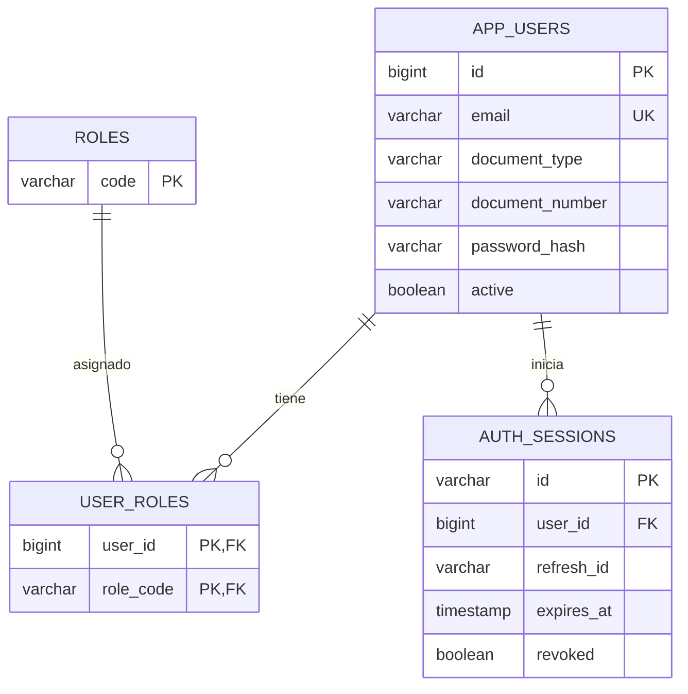

# Modelo inicial propio — autenticación S2

Migración: `src/main/resources/db/migration/V1__identity_and_sessions.sql`. Se implementa el subconjunto de identidad, no todo el esquema de citas del PRD.

## Claves y dependencias funcionales
`app_users.id → first_name, last_name, document_type, document_number, email, phone, password_hash, active`.
Claves candidatas adicionales: email; par (document_type, document_number). La misma cifra puede identificar documentos de tipos distintos.

`roles.code` es el identificador estable del catálogo fijo USER/PROFESSIONAL/ADMIN.
`user_roles(user_id, role_code)` es clave compuesta sin atributos no clave.
`auth_sessions.id → user_id, refresh_id, expires_at, revoked`.

## Normalización
1FN: atributos atómicos; roles en relación N:M, no listas en la tabla de usuario.
2FN: todos los atributos dependen de la clave completa; tabla puente sin dependencias parciales.
3FN: no se repiten nombres de roles, EPS, planes o sedes en usuario/sesión; no hay dependencias transitivas entre atributos no clave de este subconjunto.

FK preservan integridad; índices únicos hacen cumplir duplicados incluso con solicitudes simultáneas. Índices de sesiones por usuario y vencimiento permiten consulta/revocación y futura depuración. Rotación refresh usa condición id+refresh_id+vigencia, no selección seguida de escritura incondicional.

No se almacenan access/refresh completos. `refresh_id` solo identifica el JWT firmado; por sí solo no autentica. La clave criptográfica permanece fuera de BD.

## Pendiente de siguientes incrementos
Modelo de EPS/afiliación, solicitudes de reprogramación y recuperación de contraseña quedan para siguientes incrementos. La comparación parcial contra el modelo de referencia está documentada a continuación; no se afirma normalización completa del dominio con el esquema actual.

## Comparación documentada con la referencia — 2026-09-30
La comparación es de cobertura y estructura; no sustituye la validación académica del trainer. V1/V2 cubren usuarios, roles, sesiones, sedes, especialidades, profesionales, relaciones N:M, bloques, slots, citas, estados e historial. Las tablas puente mantienen las relaciones multivaluadas fuera de las entidades y las transacciones referencian catálogos/estados por FK.

En `database/reference/erd.mmd`, `ROLES` usa una clave sustituta más `code` único; V1 usa el código estable como PK natural. Ambas formas evitan repetir atributos descriptivos de rol. `AUTH_SESSIONS` implementa la sesión de refresh del incremento S2; la referencia la representa como `REFRESH_TOKENS` y también incluye `PASSWORD_RESET_TOKENS`.

El modelo de referencia agrega EPS, regímenes, planes, afiliaciones y solicitudes de reprogramación, no implementados en S2/V2. Su ausencia no es una anomalía 3FN en las tablas existentes, pero sí una diferencia de cobertura del PRD para incrementos posteriores. No se afirma que el dominio completo esté implementado o normalizado por esta comparación parcial.
